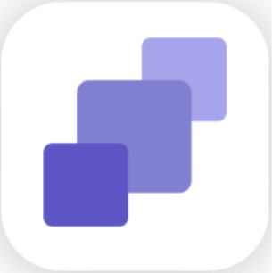

# Android Client

----

## 介绍
本项目将实现一个数据采集，标注模块的安卓APP。后端服务器的实现在[这里](https://github.com/Wang-GY/Data-Collection-Annotation-Android-App)
## 功能实现
- [x] 登录界面
- [ ] 主界面
- [ ] 用户信息页
- [ ] 任务详情页
- [ ] 我的任务页
- [ ] 数据采集页
- [ ] 数据标注页
## 技术栈
- [Material Design](https://material.io/guidelines/#introduction-principles) UI设计规范
- [MVVM](https://en.wikipedia.org/wiki/Model%E2%80%93view%E2%80%93viewmodel)
- [Restrofit2](https://github.com/square/retrofit) 处理Restful HTTP请求端
- [RxJava2](https://github.com/ReactiveX/RxJava) Java异步框架
- [Data Binding](https://developer.android.com/topic/libraries/data-binding/index.html) 数据绑定
- [JSON Server](https://github.com/typicode/json-server) Fake REST API

## 许可证

 本作品采用<a rel="license" href="http://creativecommons.org/licenses/by-nc-nd/4.0/">知识共享署名-非商业性使用-禁止演绎 4.0 国际许可协议</a>进行许可